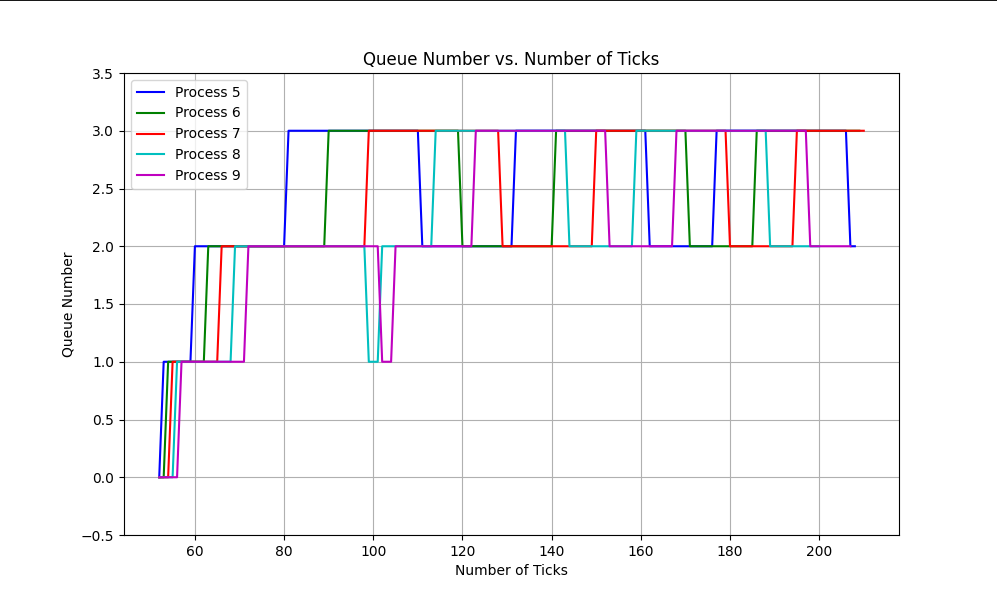

# xv6

This repository contains a modified version of the xv6 teaching operating system, enhanced with advanced scheduling algorithms, new system calls, and improved memory management as part of the Operating Systems and Networks course at IIITH (Monsoon 2023).


## Part A: System Calls & Foundational Schedulers

This project introduced foundational concepts by adding new system calls and implementing two classic scheduling policies to replace the default Round Robin scheduler.

### System Call Additions

Two new system call families were added to enhance process interaction and control.

1.  **`getreadcount()`**
    * **Purpose**: A simple system call to track the total number of `read()` operations performed across all processes since the kernel booted.
    * **Implementation**: A global counter was added to the kernel, which is atomically incremented every time the `sys_read()` function is invoked. The `getreadcount()` system call simply returns the current value of this counter.
    ```c
    int getreadcount(void);
    ```

2.  **`sigalarm(interval, handler)` and `sigreturn()`**
    * **Purpose**: Implemented a user-level interrupt mechanism. A process can request the kernel to alert it after a specified number of its own CPU ticks have passed.
    * **Mechanism**:
        * `sigalarm(interval, handler)`: A process calls this to set an alarm. `interval` is the number of CPU ticks, and `handler` is a pointer to a function in the user's code.
        * The kernel stores the interval and handler address in the process's `proc` structure. It also keeps track of the ticks consumed by the process.
        * When the consumed ticks match the interval, the kernel saves the current trapframe (registers, program counter, etc.) and redirects the process's execution to the user-provided handler function.
        * `sigreturn()`: After the handler function finishes, it must call `sigreturn()`. This system call restores the saved trapframe, allowing the process to seamlessly resume its original execution as if it was never interrupted.

### First Come First Serve (FCFS) Scheduler

* **Policy**: A **non-preemptive** scheduling algorithm that selects the process with the earliest creation time. Once a process is scheduled, it runs to completion or until it voluntarily yields the CPU (e.g., for I/O).
* **Implementation**:
    * The `proc` structure was modified to include a `creation_time` field, which is set to the current value of the global `ticks` variable when a process is created in `allocproc()`.
    * The main `scheduler()` loop was modified to iterate through all runnable processes and select the one with the minimum `creation_time`.
    * Preemption in the timer interrupt (`usertrap()`) was disabled to ensure that a running process is not interrupted by the scheduler until it yields.

### Multi-Level Feedback Queue (MLFQ) Scheduler

* **Policy**: A **preemptive, priority-based** scheduler designed to favor I/O-bound and interactive processes over CPU-bound ones, while preventing starvation.
* **Implementation**:
    * **Queues**: Four priority queues (0 to 3) were implemented, with 0 being the highest priority.
    * **Time Slices**: Each queue has a progressively larger time slice:
        * Queue 0: 1 tick
        * Queue 1: 3 ticks
        * Queue 2: 9 ticks
        * Queue 3: 15 ticks (and uses Round Robin)
    * **Process Flow**:
        * New processes enter at the highest priority (Queue 0).
        * The scheduler always picks a process from the highest-priority non-empty queue.
        * If a process uses its entire time slice, its priority is lowered, and it's moved to the next lower queue.
        * If a process yields the CPU (e.g., for I/O), it re-enters the *same* queue when it becomes ready again, preserving its priority.
        * Higher-priority processes preempt lower-priority ones.
    * **Aging**: To prevent starvation of processes in lower-priority queues, an aging mechanism was implemented. If a process waits for too long in a queue, its priority is boosted, and it is moved to the next higher queue.

    

---

## Part B: Advanced Scheduling & Memory Management
This project implements a sophisticated Priority Based Scheduler (PBS) and a Copy-on-Write (CoW) fork mechanism in the xv6 operating system, enhancing both performance and memory efficiency.

---
## Modified Priority Based Scheduler (PBS)

This preemptive, priority-based scheduler dynamically adjusts process priority based on recent behavior. This ensures a balance between responsiveness for I/O-bound tasks and throughput for CPU-bound tasks.

### Implementation Details:
* **Static Priority (SP):** A base priority for each process, ranging from 0-100 (lower value means higher priority), with a default of 50.
* **Recent Behaviour Index (RBI):** An index that reflects whether a process is CPU-bound or I/O-bound, calculated as:
    $$RBI = \max\bigg(\text{Int}\bigg(\dfrac{3 \times RTime - STime - WTime}{RTime + WTime + STime + 1} \times 50\bigg), 0\bigg)$$
* **Dynamic Priority (DP):** The final priority used for scheduling, calculated as:
    $$DP = \min(SP + RBI, 100)$$
* **Tie-Breaking:** If multiple processes share the same DP, the tie is broken first by the number of times scheduled, and then by the start time.
* **`set_priority()` System Call:** A new system call to dynamically change the Static Priority (SP) of a process.

### Analysis:
The PBS scheduler effectively prioritizes processes based on their importance and recent behavior. Performance analysis shows:
* **Average rtime 16, wtime 167 for PBS**
* **Average rtime 18, wtime 171 for RR**

---
## Copy-on-Write (CoW) Fork

This implementation optimizes the `fork()` system call by delaying page allocation until a write operation occurs, significantly saving memory.

### Implementation:
* **Shared, Read-Only Pages:** On fork, pages are shared between parent and child processes and marked as read-only with a `PTE_COW` flag.
* **Page Fault Handling:** A write attempt to a shared page triggers a page fault, which is handled by the `cow_alloc` function.
* **Copying and Remapping:** A new page is allocated, the content is copied, and the page is remapped with write permissions for the faulting process.
* **Reference Counting:** A reference count is maintained for each page to ensure it's freed only when no longer in use by any process.

### Testing:
The `cowtest` demonstrates the success of the implementation:
$ cowtest
simple: ok
simple: ok
three: ok
three: ok
three: ok
file: ok
ALL COW TESTS PASSED
